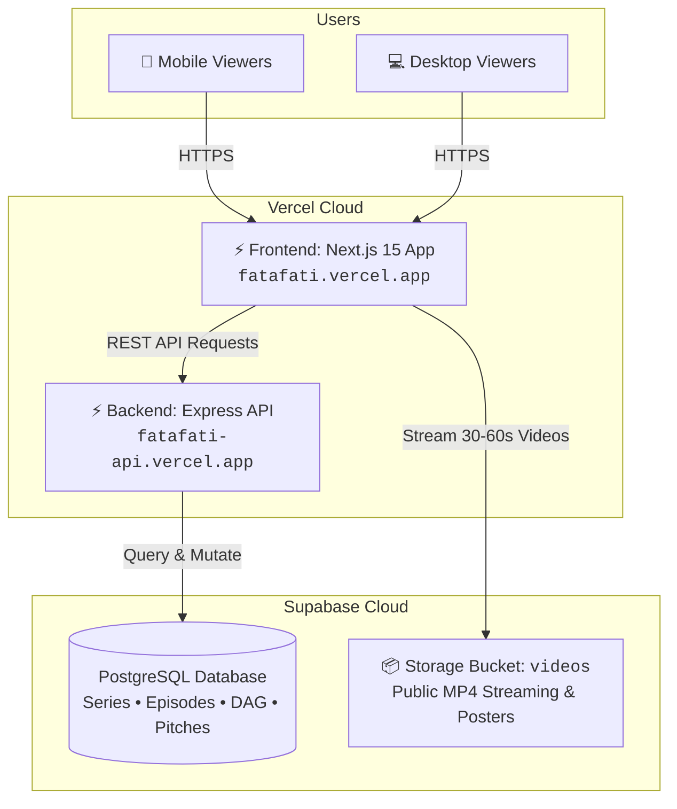

# 🚀 FataFati — Full Deployment Guide (Supabase + Vercel)

This document provides complete, step-by-step instructions to deploy the **FataFati** platform from scratch to production using **Supabase** (Database & Video Storage) and **Vercel** (Serverless Backend API & Next.js Frontend).

---

## 🏗️ Architecture Overview



---

## 📋 Prerequisites

Before starting, ensure you have:
1. A **GitHub** account with your repo pushed to `https://github.com/redhat125/fatafati`.
2. A free **[Supabase](https://supabase.com)** account.
3. A free **[Vercel](https://vercel.com)** account (logged in with GitHub).

---

## 🗄️ Step 1: Supabase Setup (Database & Video Storage)

### 1.1 Create Supabase Project
1. Go to [database.new](https://database.new) and create a new project named **Fatafati**.
2. Set a secure database password and choose your nearest region.

### 1.2 Run the Database Schema & RLS Policies
1. In your Supabase Dashboard, click **SQL Editor** (left sidebar) → **New query**.
2. Copy and paste the entire content of [`fatafati-be/src/db/schema.sql`](fatafati-be/src/db/schema.sql):
   - Creates `series`, `episodes`, `episode_choices`, `comments`, `comment_votes`, `user_journeys`.
   - Enables Row Level Security (RLS) with public access policies.
3. Click **Run**.

### 1.3 Create the Public Video Storage Bucket
1. In Supabase Dashboard, click **Storage** (left sidebar) → **New bucket**.
2. Configure the bucket:
   - **Bucket Name**: `videos`
   - **Public bucket**: **ON (Checked)** *(Essential for frontend video streaming)*
3. Click **Save bucket**.

### 1.4 Get Your Project Credentials
1. In Supabase Dashboard, go to **Settings (⚙️ Gear icon)** → **API**.
2. Note down:
   - **Project URL**: `https://<YOUR-PROJECT-ID>.supabase.co`
   - **`service_role` (secret)** key *(under Project API keys)*

### 1.5 Seed the Live Database with 4 Series & 20 Branching Episodes
In your local repository:
1. Open [`fatafati-be/.env`](fatafati-be/.env) and set:
   ```env
   SUPABASE_URL=https://<YOUR-PROJECT-ID>.supabase.co
   SUPABASE_ANON_KEY=<YOUR-SERVICE-ROLE-KEY>
   ```
2. Run the automated seeder script from your terminal:
   ```bash
   npm run seed --workspace=@fatafati/backend
   ```
   *(This populates all 4 multi-genre series, 20 branching episodes, DAG choices, and sample community pitches into your live Supabase database)*.

---

## ⚡ Step 2: Deploy Backend API on Vercel (`fatafati-be`)

1. Go to **[vercel.com/new](https://vercel.com/new)**.
2. Select your **`fatafati`** GitHub repository and click **Import**.
3. Configure the Project:
   - **Project Name**: `fatafati-api` *(or any custom name)*
   - **Framework Preset**: `Other`
   - **Root Directory**: Click **Edit** → select **`fatafati-be`** → click **Continue**.
4. Expand **Environment Variables** and add the following 3 variables:

   | Key | Value | Notes |
   | :--- | :--- | :--- |
   | `SUPABASE_URL` | `https://<YOUR-PROJECT-ID>.supabase.co` | Your Supabase project URL |
   | `SUPABASE_ANON_KEY` | `<YOUR-SERVICE-ROLE-KEY>` | Your Supabase secret/service key |
   | `CORS_ORIGIN` | `*` | Allows cross-origin API calls |

5. Click **Deploy**.
6. When deployment finishes, copy your live Backend URL:
   - Example: `https://fatafati-api.vercel.app`

#### 🧪 Verify Backend Deployment:
Open these URLs in your browser:
- `https://fatafati-api.vercel.app/api/health` → `{"status":"ok"}`
- `https://fatafati-api.vercel.app/api/series` → Returns all 4 seeded series JSON

---

## 🌐 Step 3: Deploy Frontend on Vercel (`fatafati-fe`)

1. In your **Vercel Dashboard**, click **Add New…** → **Project**.
2. Select the same **`fatafati`** GitHub repository and click **Import**.
3. Configure the Project:
   - **Project Name**: `fatafati` *(this becomes your main website URL)*
   - **Framework Preset**: `Next.js` *(automatically detected)*
   - **Root Directory**: Click **Edit** → select **`fatafati-fe`** → click **Continue**.
4. Expand **Environment Variables** and add:

   | Key | Value | Notes |
   | :--- | :--- | :--- |
   | `NEXT_PUBLIC_API_URL` | `https://fatafati-api.vercel.app` | The backend API URL from Step 2 |

5. Click **Deploy**.
6. When deployment finishes, your live website is ready at:
   - Example: `https://fatafati.vercel.app`

---

## 🎬 Step 4: Adding Your Custom Videos & Thumbnails

### 4.1 Upload Media to Supabase Storage
1. In Supabase Dashboard → **Storage** → open the **`videos`** bucket.
2. Click **Upload file** and upload your video (e.g. `ep1.mp4`) and poster (e.g. `ep1_thumb.jpg`).
3. Click the `...` menu on the file → **Get URL** / **Copy URL**:
   ```text
   https://<YOUR-PROJECT-ID>.supabase.co/storage/v1/object/public/videos/ep1.mp4
   ```

### 4.2 Update Episode Record in Supabase
1. In Supabase Dashboard → **Table Editor** → click the **`episodes`** table.
2. Find the target episode row and update:
   - `video_url`: `https://<YOUR-PROJECT-ID>.supabase.co/storage/v1/object/public/videos/ep1.mp4`
   - `thumbnail_url`: `https://<YOUR-PROJECT-ID>.supabase.co/storage/v1/object/public/videos/ep1_thumb.jpg`
3. Refresh your live frontend — your custom video streams instantly!

---

## 🔄 Step 5: Continuous Deployment (Git Workflow)

Both Vercel projects are linked to your GitHub repository:
- Any `git push origin main` triggers an automatic zero-downtime rebuild.
- **Backend-only changes** (`fatafati-be/*`) redeploy the API in seconds.
- **Frontend-only changes** (`fatafati-fe/*`) update the UI instantaneously across Vercel's global edge network.

---

## ✅ Deployment Checklist

- [ ] Supabase project created
- [ ] SQL schema & RLS policies executed
- [ ] `videos` storage bucket created (Public: ON)
- [ ] Supabase seeded with `npm run seed --workspace=@fatafati/backend`
- [ ] Backend deployed to Vercel with `SUPABASE_URL` and `SUPABASE_ANON_KEY`
- [ ] Frontend deployed to Vercel with `NEXT_PUBLIC_API_URL`
- [ ] Live testing: Video playback, Branch selection, Writers Room pitching, Upvoting
