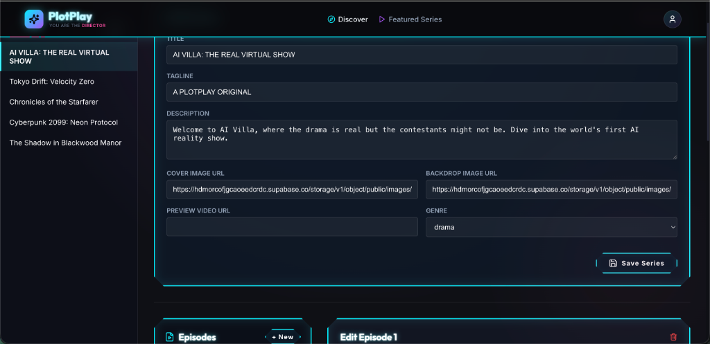

# Fatafati Project

Fatafati is a monorepo containing a Next.js frontend and an Express.js backend.

## Project Structure

- `fatafati-fe/`: Frontend application built with Next.js, React, and Lucide Icons.
- `fatafati-be/`: Backend API built with Express.js, TypeScript, and Supabase.
- `packages/common/`: Shared code, types, and schemas used by both the frontend and backend.

## Getting Started

### Prerequisites
- Node.js (v18+ recommended)
- npm (Workspace support)

### Installation
1. Clone the repository.
2. Run `npm install` at the root directory to install all dependencies for all workspaces.

### Running the Application Locally

You can start the frontend and backend from their respective directories.

**Frontend:**
```bash
cd fatafati-fe
npm run dev
```

**Backend:**
```bash
cd fatafati-be
npm run dev
```

For more detailed information, please see the individual READMEs:
- [Frontend README](./fatafati-fe/README.md)
- [Backend README](./fatafati-be/README.md)

## Admin Dashboard

Plotplay includes a powerful, Cyberpunk-themed Admin Content Management Panel at `/admin/contents`. 



### Features
- **Series Management**: Create, edit, and delete Series, managing titles, genres, and cover images.
- **Episode Editor**: Add synopses, attach video URLs, and configure thumbnails.
- **Interactive Flags**: Toggle episode statuses (`ready`, `generating`, `scheduled`), set end-of-episode questions, and mark episodes as the Series Finale.
- **Branching Choices**: Add branching options ("YES" / "NO"), configure action text, and assign target episode IDs to shape the user's interactive journey.
