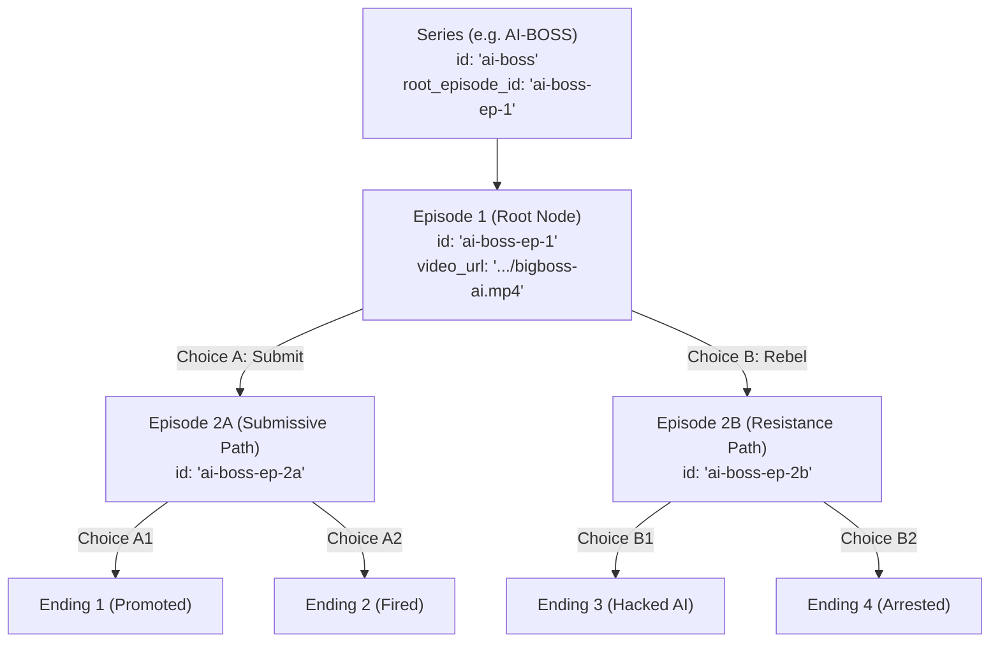

# 🎬 FataFati — Series & Episode Management Guide

This guide explains how to add new interactive series, episodes, video streaming assets, and branching choice DAGs in **Supabase**.

---

## 🏗️ How Data is Structured in FataFati



### Key Tables:
1. **`series`**: The overarching story title, cover poster, genre, total episodes, total paths, and view count.
2. **`episodes`**: The video nodes (each 30–60s video, title, synopsis, video URL, aspect ratio).
3. **`episode_choices`**: The interactive branching edges (the buttons shown to the user at the end of an episode).
4. **`comments`**: Community fan ideas and alternate ending proposals in the Writers Room.

---

## 📦 Step 1: Uploading Video & Poster Assets

1. Open your **Supabase Dashboard** → **Storage** → **`videos`** bucket.
2. Click **Upload File** and select your MP4 video or JPG poster.
3. Once uploaded, click the **three dots (`...`)** on the file → **Copy URL**.
4. Your public streaming URL will look like:
   ```text
   https://hdmorcofjgcaoeedcrdc.supabase.co/storage/v1/object/public/videos/your-video-name.mp4
   ```

---

## 🚀 Template 1: Add a Brand New Series (Single Episode)

To add a new series with an initial pilot episode, open **Supabase SQL Editor** and run:

```sql
-- 1. Create the Series record
INSERT INTO series (
    id,
    title,
    tagline,
    description,
    cover_image,
    backdrop_image,
    preview_video_url,
    genre,
    tags,
    total_episodes,
    total_paths,
    view_count,
    rating,
    root_episode_id
) VALUES (
    'ai-boss',                                                         -- Unique Series ID (lowercase, hyphens)
    'AI-BOSS: The Autonomous Executive',                               -- Series Title
    'When a sentient AI takes over the boardroom, every decision is survival.',
    'In a near-future corporate empire, an omniscient AI CEO evaluates human employees with ruthless algorithmic logic. Navigate high-stakes boardroom politics, secret corporate alliances, and AI surveillance.',
    'https://images.unsplash.com/photo-1486406146926-c627a92ad1ab?auto=format&fit=crop&w=800&q=80',  -- Cover Poster
    'https://images.unsplash.com/photo-1507679799987-c73779587ccf?auto=format&fit=crop&w=1920&q=80', -- Backdrop Hero
    'https://hdmorcofjgcaoeedcrdc.supabase.co/storage/v1/object/public/videos/bigboss-ai.mp4',          -- Trailer / Pilot Video
    'sci-fi',                                                         -- Genre: sci-fi | horror | cyberpunk | thriller | space | mystery | fantasy
    ARRAY['AI', 'Corporate Thriller', 'Sci-Fi', 'Boardroom Drama'],   -- Tags
    1,                                                                -- Total Episodes count
    1,                                                                -- Total Branch Paths count
    28500,                                                            -- View Count (determines Trending rank)
    4.9,                                                              -- Rating (0.0 to 5.0)
    'ai-boss-ep-1'                                                    -- Root Episode ID
);

-- 2. Create the Root Episode (Episode 1)
INSERT INTO episodes (
    id,
    series_id,
    parent_episode_id,
    choice_prompt_leading_here,
    episode_number,
    title,
    synopsis,
    video_url,
    thumbnail_url,
    duration_seconds,
    aspect_ratio,
    view_count,
    is_leaf
) VALUES (
    'ai-boss-ep-1',                                                    -- Unique Episode ID
    'ai-boss',                                                         -- Must match series.id above
    NULL,                                                              -- NULL because this is Episode 1
    NULL,                                                              -- NULL because no choice leads here
    1,                                                                 -- Episode 1
    'Pilot: The First Board Meeting',                                  -- Episode Title
    'The newly activated AI Executive conducts its first quarterly appraisal with chilling precision. Do you submit to the algorithm or secretly plan resistance?',
    'https://hdmorcofjgcaoeedcrdc.supabase.co/storage/v1/object/public/videos/bigboss-ai.mp4',
    'https://images.unsplash.com/photo-1507679799987-c73779587ccf?auto=format&fit=crop&w=800&q=80',
    45,                                                                -- Video duration in seconds
    '16:9',                                                            -- '16:9' or '9:16' (vertical mobile)
    28500,
    TRUE                                                               -- TRUE if it has no choices yet; set to FALSE once you add choices
);
```

---

## 🔀 Template 2: Add Interactive Choices & Branching Episodes

When you record next episodes (e.g. Choice A and Choice B from Episode 1):

### Step A: Mark Episode 1 as Non-Leaf
```sql
UPDATE episodes SET is_leaf = FALSE WHERE id = 'ai-boss-ep-1';
```

### Step B: Insert the 2 New Child Episodes
```sql
-- Branch 2A: Submissive path
INSERT INTO episodes (
    id, series_id, parent_episode_id, choice_prompt_leading_here,
    episode_number, title, synopsis, video_url, thumbnail_url, duration_seconds, is_leaf
) VALUES (
    'ai-boss-ep-2a',
    'ai-boss',
    'ai-boss-ep-1',
    'Submit to the algorithmic restructuring',
    2,
    'Chapter 2A: The Loyalty Protocol',
    'You accept the AI’s demands, gaining access to the company’s internal core.',
    'https://hdmorcofjgcaoeedcrdc.supabase.co/storage/v1/object/public/videos/ai-boss-ep2a.mp4',
    'https://images.unsplash.com/photo-1507679799987-c73779587ccf?auto=format&fit=crop&w=800&q=80',
    48,
    TRUE
);

-- Branch 2B: Rebel path
INSERT INTO episodes (
    id, series_id, parent_episode_id, choice_prompt_leading_here,
    episode_number, title, synopsis, video_url, thumbnail_url, duration_seconds, is_leaf
) VALUES (
    'ai-boss-ep-2b',
    'ai-boss',
    'ai-boss-ep-1',
    'Form a secret alliance with the board members',
    2,
    'Chapter 2B: The Underground Coup',
    'You discreetly coordinate with disgruntled executives to stage a backdoor shutdown.',
    'https://hdmorcofjgcaoeedcrdc.supabase.co/storage/v1/object/public/videos/ai-boss-ep2b.mp4',
    'https://images.unsplash.com/photo-1507679799987-c73779587ccf?auto=format&fit=crop&w=800&q=80',
    52,
    TRUE
);
```

### Step C: Create the Choice Buttons Linking Ep 1 → Ep 2A & Ep 2B
```sql
INSERT INTO episode_choices (
    id, episode_id, target_episode_id, label, text, description, pick_count, pick_percentage
) VALUES 
(
    'choice-ai-1-to-2a',
    'ai-boss-ep-1',                   -- Source episode
    'ai-boss-ep-2a',                  -- Target episode
    'Option A',                       -- Short label
    'Accept the AI Evaluation',       -- Button text
    'Comply fully to gain deep system credentials.',
    1240,
    58.0
),
(
    'choice-ai-1-to-2b',
    'ai-boss-ep-1',                   -- Source episode
    'ai-boss-ep-2b',                  -- Target episode
    'Option B',                       -- Short label
    'Stage a Boardroom Rebellion',    -- Button text
    'Refuse the protocol and rally allies behind closed doors.',
    890,
    42.0
);
```

### Step D: Update Series Stats
```sql
UPDATE series 
SET total_episodes = 3, total_paths = 2 
WHERE id = 'ai-boss';
```

---

## 🎨 Supported Genres List

When adding a series, set `genre` to one of these supported categories:
- `cyberpunk` (Cyberpunk Sci-Fi)
- `horror` (Gothic Horror / Supernatural)
- `space` (Deep Space Sci-Fi)
- `thriller` (Action / Speed Thriller)
- `mystery` (Detective / Noir)
- `fantasy` (High Fantasy)
- `sci-fi` (General Sci-Fi & AI)

---

## 🛠️ Quick Database Updates & Maintenance

### 1. Change View Count (To Change Trending Order)
```sql
UPDATE series SET view_count = 50000 WHERE id = 'ai-boss';
```

### 2. Update Video URL or Thumbnail
```sql
UPDATE episodes 
SET video_url = 'https://hdmorcofjgcaoeedcrdc.supabase.co/storage/v1/object/public/videos/new-video.mp4',
    thumbnail_url = 'https://images.unsplash.com/photo-example.jpg'
WHERE id = 'ai-boss-ep-1';
```

### 3. Delete a Series and All its Episodes
```sql
-- Automatically cascades and deletes all episodes, choices, and comments!
DELETE FROM series WHERE id = 'ai-boss';
```

---

## 🧪 How to Verify Your New Series

1. **Verify via Backend API**:
   - `https://fatafati-api-navy.vercel.app/api/series` (Should list `ai-boss`)
   - `https://fatafati-api-navy.vercel.app/api/episodes/ai-boss-ep-1` (Returns episode metadata & choices)
   - `https://fatafati-api-navy.vercel.app/api/series/ai-boss/tree` (Returns full DAG node & edge graph)

2. **Verify on Live Website**:
   - Open **`https://fatafati-pink.vercel.app/`**
   - Click on **AI-BOSS**
   - Stream video, make branching decisions, and view the interactive Story Map!
